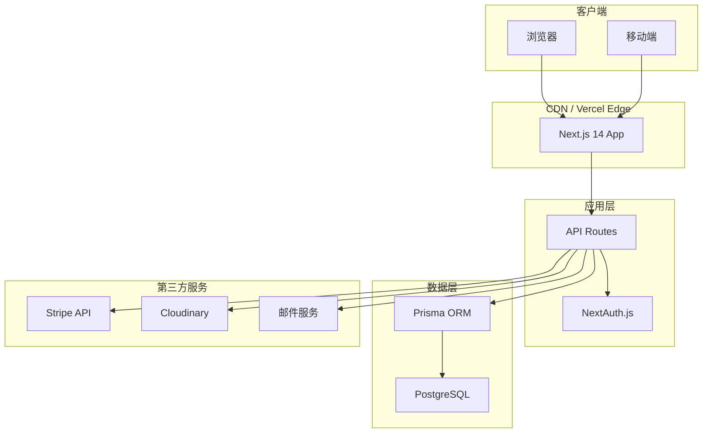
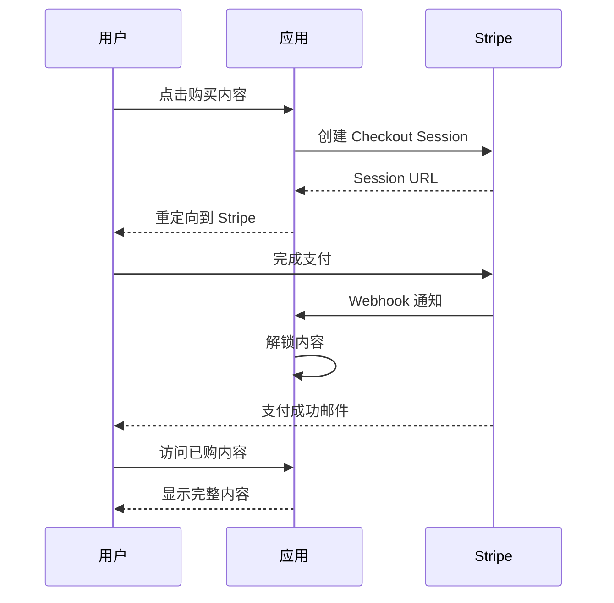
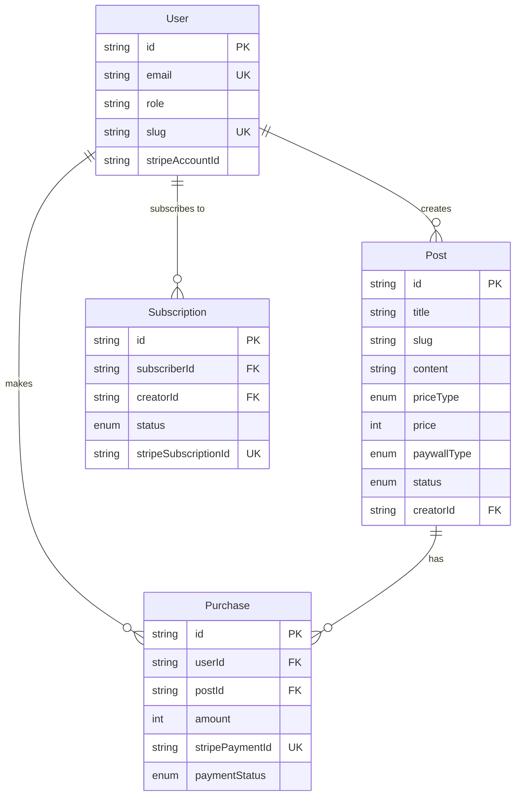

# ContentPay - 付费内容订阅平台技术设计

需求名称：contentpay-subscription
更新日期：2026-03-25

## 1. 概述

ContentPay 是一个面向创作者的 SaaS 平台，支持 5 分钟搭建个人付费内容站点。平台允许创作者发布付费文章、资源内容，并提供会员订阅功能。

### 1.1 核心功能范围

| 模块 | 功能 |
|------|------|
| 创作者端 | 内容发布、定价设置、内容管理、收入看板、订阅者管理 |
| 读者端 | 内容浏览、付费购买、会员订阅、个人中心、邮件通知 |
| 支付系统 | Stripe 集成、收入提现、退款处理、优惠券 |

### 1.2 技术栈

| 层级 | 技术选型 |
|------|----------|
| 前端 | Next.js 14 (App Router) + Tailwind CSS |
| 后端 | Next.js API Routes + Prisma ORM |
| 数据库 | PostgreSQL |
| 认证 | NextAuth.js (邮箱/密码) |
| 支付 | Stripe (Checkout + Customer Portal) |
| 存储 | 本地/Cloudinary |
| 部署 | Vercel + Railway/Supabase |

---

## 2. 架构

### 2.1 系统架构图



### 2.2 页面路由结构

| 页面 | 路由 | 说明 |
|------|------|------|
| 创作者主页 | `/[creator]` | 展示创作者内容和订阅入口 |
| 内容详情 | `/[creator]/[post]` | 文章阅读，支持付费墙 |
| 结账页面 | `/checkout/[post]` | Stripe 支付流程 |
| 创作者后台 | `/dashboard` | 内容管理、收入看板 |
| 读者个人中心 | `/account` | 已购内容、订阅管理 |

### 2.3 核心模块划分

```
src/
├── app/                    # Next.js App Router
│   ├── (creator)/         # 创作者相关页面
│   │   ├── [slug]/        # 创作者主页
│   │   └── [slug]/[post]/ # 内容详情
│   ├── checkout/          # 支付流程
│   ├── dashboard/         # 创作者后台
│   ├── account/           # 读者个人中心
│   └── api/               # API Routes
│       ├── auth/          # 认证 API
│       ├── posts/         # 内容 API
│       ├── payments/      # 支付 API
│       ├── webhooks/      # Stripe Webhooks
│       └── subscriptions/ # 订阅 API
├── components/            # React 组件
│   ├── ui/               # 基础 UI 组件
│   ├── editor/           # 富文本编辑器
│   ├── payment/          # 支付相关组件
│   └── dashboard/        # 后台管理组件
├── lib/                   # 工具库
│   ├── prisma.ts         # Prisma 客户端
│   ├── stripe.ts         # Stripe 配置
│   ├── auth.ts           # NextAuth 配置
│   └── email.ts          # 邮件服务
└── types/                # TypeScript 类型
```

---

## 3. 组件与接口

### 3.1 核心 API 接口

#### 3.1.1 内容管理 API

| 接口 | 方法 | 路径 | 说明 |
|------|------|------|------|
| 创建内容 | POST | `/api/posts` | 创作者发布新内容 |
| 更新内容 | PUT | `/api/posts/[id]` | 更新内容 |
| 删除内容 | DELETE | `/api/posts/[id]` | 删除内容 |
| 获取内容列表 | GET | `/api/posts` | 获取当前用户内容列表 |
| 获取公开内容 | GET | `/api/posts/public/[creator]` | 获取创作者公开内容 |

#### 3.1.2 支付 API

| 接口 | 方法 | 路径 | 说明 |
|------|------|------|------|
| 创建 Checkout Session | POST | `/api/payments/checkout` | 创建 Stripe 结账会话 |
| 验证购买状态 | GET | `/api/payments/verify/[postId]` | 验证用户是否已购买 |
| 获取支付历史 | GET | `/api/payments/history` | 获取用户支付记录 |
| 创建退款 | POST | `/api/payments/refund` | 创作者发起退款 |

#### 3.1.3 订阅 API

| 接口 | 方法 | 路径 | 说明 |
|------|------|------|------|
| 创建订阅 | POST | `/api/subscriptions` | 创建会员订阅 |
| 取消订阅 | DELETE | `/api/subscriptions/[id]` | 取消订阅 |
| 获取订阅状态 | GET | `/api/subscriptions/status` | 获取用户订阅状态 |
| 订阅者列表 | GET | `/api/subscriptions/subscribers` | 创作者查看订阅者 |

#### 3.1.4 Webhook 接口

| 接口 | 方法 | 路径 | 说明 |
|------|------|------|------|
| Stripe Webhook | POST | `/api/webhooks/stripe` | 处理 Stripe 事件 |

### 3.2 Stripe 集成流程



---

## 4. 数据模型

### 4.1 Prisma Schema

```prisma
enum Role {
  CREATOR  // 创作者
  READER   // 读者
}

enum PostStatus {
  DRAFT      // 草稿
  PUBLISHED  // 已发布
}

enum PriceType {
  FREE       // 免费
  ONE_TIME   // 单次购买
  SUBSCRIPTION // 订阅
}

enum PaywallType {
  FULL       // 完全付费
  PREVIEW    // 部分免费（前30%）
  MEMBERSHIP // 会员专享
}

enum SubscriptionStatus {
  ACTIVE   // 有效
  CANCELED // 已取消
  EXPIRED  // 已过期
}

enum PaymentStatus {
  PENDING    // 待支付
  SUCCEEDED  // 成功
  FAILED     // 失败
  REFUNDED   // 已退款
}

model User {
  id            String    @id @default(cuid())
  email         String    @unique
  password      String?   // 加密存储，第三方登录时为空
  name          String?
  avatar        String?
  role          Role      @default(READER)
  bio           String?   // 创作者简介
  slug          String?   @unique // 创作者主页路径
  stripeAccountId String? // Stripe Connect 账户 ID
  
  posts         Post[]      // 创作者发布的内容
  purchases     Purchase[]  // 读者的购买记录
  subscriptions Subscription[] // 订阅关系（作为读者）
  receivedSubscriptions Subscription[] @relation("CreatorSubscriptions") // 收到的订阅（作为创作者）
  
  createdAt     DateTime  @default(now())
  updatedAt     DateTime  @updatedAt
}

model Post {
  id            String    @id @default(cuid())
  title         String
  slug          String    // URL 友好slug
  content       String?   // Markdown/富文本内容
  excerpt       String?   // 摘要/预览内容
  
  priceType     PriceType @default(FREE)
  price         Int?      // 价格（分）
  currency      String    @default("usd")
  
  paywallType   PaywallType @default(FULL)
  previewRatio  Int?      @default(30) // 免费预览比例 %
  
  status        PostStatus @default(DRAFT)
  publishedAt   DateTime?
  
  creatorId     String
  creator       User      @relation(fields: [creatorId], references: [id])
  
  purchases     Purchase[]
  
  createdAt     DateTime  @default(now())
  updatedAt     DateTime  @updatedAt
  
  @@unique([creatorId, slug])
}

model Purchase {
  id              String   @id @default(cuid())
  userId          String
  user            User     @relation(fields: [userId], references: [id])
  postId          String
  post            Post     @relation(fields: [postId], references: [id])
  
  amount          Int      // 支付金额（分）
  currency        String   @default("usd")
  
  stripePaymentId String  @unique
  paymentStatus   PaymentStatus @default(PENDING)
  
  createdAt       DateTime @default(now())
  
  @@unique([userId, postId])
}

model Subscription {
  id              String   @id @default(cuid())
  
  subscriberId    String
  subscriber      User     @relation("Subscriber", fields: [subscriberId], references: [id])
  
  creatorId       String
  creator         User     @relation("Creator", fields: [creatorId], references: [id])
  
  status          SubscriptionStatus @default(ACTIVE)
  
  plan            String   // monthly / yearly
  amount          Int      // 订阅金额（分）
  
  stripeSubscriptionId String @unique
  
  currentPeriodStart DateTime
  currentPeriodEnd   DateTime
  
  canceledAt       DateTime?
  
  createdAt        DateTime @default(now())
  updatedAt        DateTime @updatedAt
  
  @@unique([subscriberId, creatorId])
}

model Coupon {
  id              String   @id @default(cuid())
  code            String   @unique
  discountType    String   // percentage / fixed
  discountValue   Int      // 折扣值
  maxUses         Int?
  usedCount       Int      @default(0)
  validFrom       DateTime
  validUntil      DateTime?
  
  creatorId       String
  
  createdAt       DateTime @default(now())
}
```

### 4.2 实体关系图



---

## 5. 正确性属性

### 5.1 支付正确性

| 属性 | 说明 |
|------|------|
| 幂等性 | 同一笔支付多次触发 Webhook 不会重复解锁内容 |
| 原子性 | 支付状态更新和内容解锁在同一个事务中 |
| 可追溯性 | 所有支付操作记录带时间戳和 Stripe 事务 ID |

### 5.2 内容访问控制

| 属性 | 说明 |
|------|------|
| 付费墙强制 | 未购买用户只能看到预览内容 |
| 实时验证 | 内容访问前再次验证购买状态 |
| 创作者豁免 | 创作者可查看自己所有内容 |

### 5.3 订阅状态同步

| 属性 | 说明 |
|------|------|
| 自动续期 | Stripe 自动续期后通过 Webhook 更新状态 |
| 过期检查 | 访问时检查订阅是否在有效期内 |
| 宽限期 | 订阅过期后 3 天内仍可访问 |

---

## 6. 错误处理

### 6.1 错误分类

| 错误类型 | HTTP 状态码 | 处理方式 |
|----------|-------------|----------|
| 参数错误 | 400 | 返回具体字段错误信息 |
| 未认证 | 401 | 跳转登录页面 |
| 无权限 | 403 | 返回权限不足提示 |
| 资源不存在 | 404 | 返回友好 404 页面 |
| Stripe 错误 | 402 | 显示支付失败原因 |
| 服务器错误 | 500 | 记录日志，返回通用错误 |

### 6.2 支付异常处理

```typescript
// 支付错误码映射
const paymentErrors = {
  card_declined: "您的银行卡被拒绝，请尝试其他支付方式",
  expired_card: "您的银行卡已过期，请更新卡信息",
  insufficient_funds: "您的账户余额不足",
  processing_error: "支付处理出错，请稍后重试",
};
```

### 6.3 Webhook 故障处理

| 场景 | 处理策略 |
|------|----------|
| Webhook 签名验证失败 | 记录日志，返回 400 |
| 重复事件 | 幂等处理，基于 paymentId 检查 |
| 处理超时 | 返回成功，后续通过 Stripe Dashboard 核对 |

---

## 7. 测试策略

### 7.1 测试分层

| 层级 | 工具 | 覆盖率目标 |
|------|------|-----------|
| 单元测试 | Vitest | 核心业务逻辑 80%+ |
| 集成测试 | Vitest + Prisma Test | API 端点 90%+ |
| E2E 测试 | Playwright | 核心用户路径 100% |

### 7.2 核心测试场景

#### 7.2.1 支付流程测试

```
1. 免费内容 → 直接访问
2. 付费内容 → 未购买 → 显示预览 + 购买按钮
3. 付费内容 → 已购买 → 显示完整内容
4. Stripe Checkout → 支付成功 → 内容解锁
5. Stripe Checkout → 支付失败 → 保持原状态
```

#### 7.2.2 订阅流程测试

```
1. 订阅创作者 → 创建 Stripe 订阅 → 立即解锁会员内容
2. 取消订阅 → 3天内仍可访问 → 第4天禁止访问
3. 续期成功 → 自动延长访问权限
```

### 7.3 Mock 策略

| 服务 | 测试环境 |
|------|----------|
| Stripe | stripe-cli / mock/stripe |
| 数据库 | SQLite in-memory + Prisma |
| 文件存储 | 本地临时目录 |
| 邮件 | Ethereal Email / Nock |

---

## 8. 部署架构

### 8.1 环境划分

| 环境 | 用途 | 数据库 |
|------|------|--------|
| Development | 本地开发 | SQLite |
| Preview | PR 预览 | Railway Dev |
| Production | 正式环境 | Railway/Supabase |

### 8.2 环境变量清单

```bash
# Database
DATABASE_URL=

# NextAuth
NEXTAUTH_URL=
NEXTAUTH_SECRET=

# Stripe
STRIPE_SECRET_KEY=
STRIPE_PUBLISHABLE_KEY=
STRIPE_WEBHOOK_SECRET=
STRIPE_MONTHLY_PRICE_ID=
STRIPE_YEARLY_PRICE_ID=

# Cloudinary
CLOUDINARY_URL=

# App
NEXT_PUBLIC_APP_URL=
```

---

## 9. 关键设计决策

### 9.1 付费墙实现

采用**服务端渲染 + 条件内容返回**策略：
- API 返回时根据用户购买状态决定是否返回完整内容
- 前端使用 CSS 渐变遮罩模拟付费墙视觉效果
- 防止恶意爬取：内容分块加载，关键部分服务端校验

### 9.2 Stripe Connect 选型

使用**Simplified Connect**（Stripe 统一收款）：
- 创作者收入先进入平台账户，支持提现
- 统一平台抽成比例计算
- 简化财务对账流程
- 后续可平滑升级为 Standard Connect

### 9.3 多创作者支持

每个 User 通过 `slug` 字段自定义创作者主页路径 `/[creatorSlug]`。使用 Next.js 动态路由实现，slug 唯一性通过数据库约束保证。

### 9.4 订阅周期

支持两种订阅周期：
- **月付**：每月自动续费
- **年付**：每年自动续费，通常提供折扣

### 9.5 富文本编辑器

采用 **TipTap** 作为内容编辑器：
- 基于 ProseMirror 的现代化编辑器
- 支持 Markdown 快捷键
- 可扩展的插件系统
- 良好的 TypeScript 支持

---

## 10. 参考文档

[^1]: NextAuth.js Documentation - https://next-auth.js.org/
[^2]: Stripe Documentation - https://stripe.com/docs
[^3]: Prisma Documentation - https://prisma.io/docs
